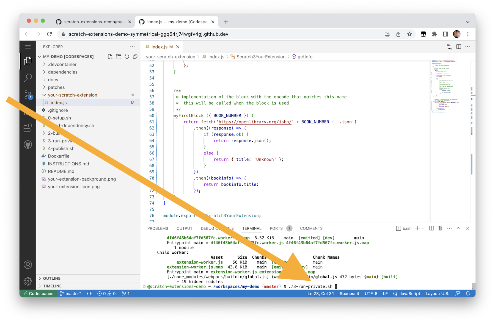
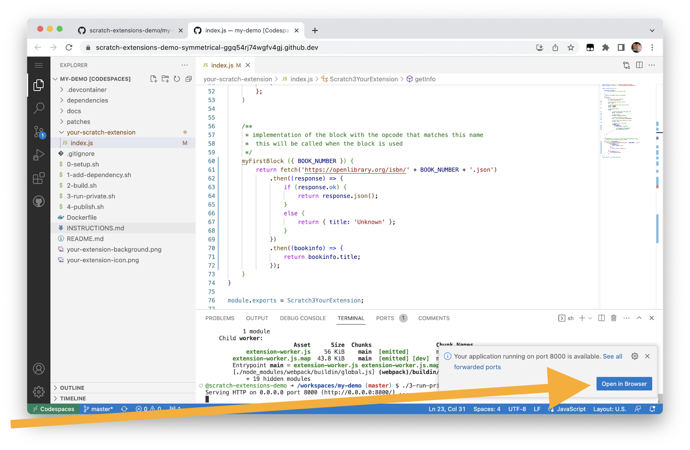
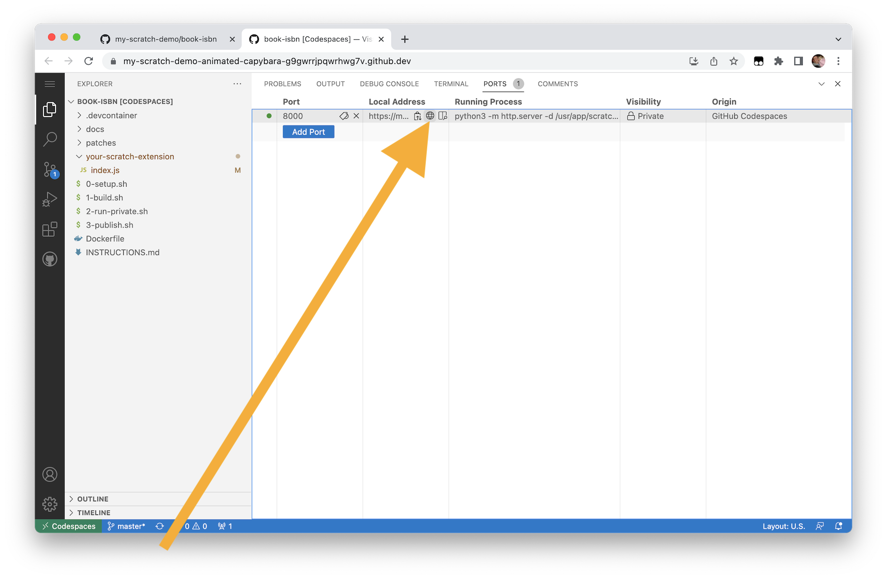
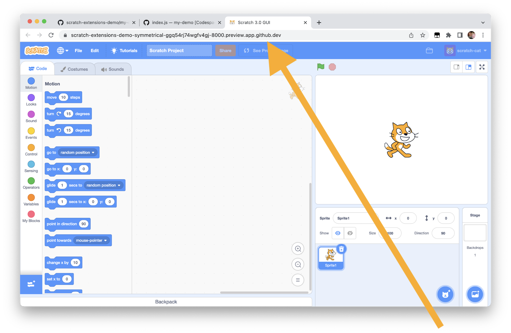
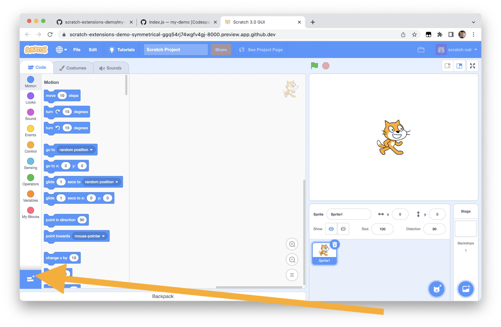
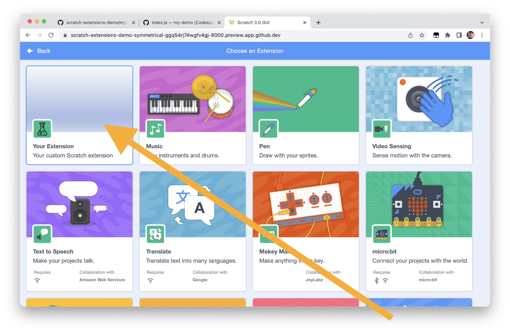
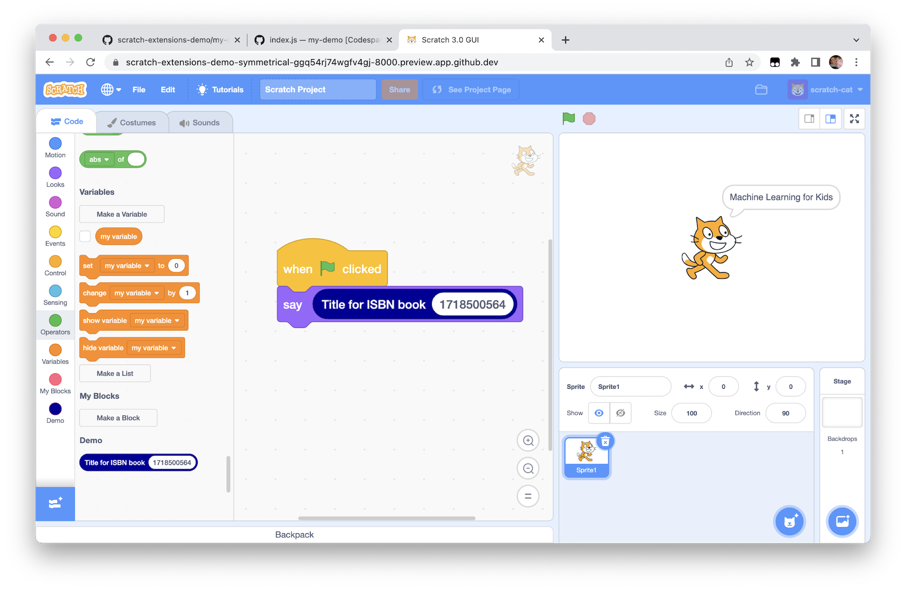
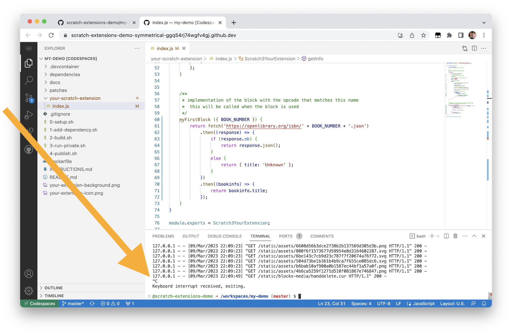

---

## Launch codespaces

Click on **Code** -> **Codespaces** -> **Create codespace**


It can take a minute or two to set up your codespace.

Your codespace is ready for use.


---

## Set up your repository

In the terminal at the bottom of the window, run:
```sh
./0-setup.sh
```


This should be very quick.

You only need to do this once (but it is safe if you run it again).


---

## Launch a private test of MQTT extension

In the terminal at the bottom of the window, run:
```sh
./2-build.sh
```


This can take a minute to run. Wait for this to complete.

In the terminal at the bottom of the window, run:
```sh
./3-run-private.sh
```



A pop-up should appear in the bottom-right with a button to open a private window with your modified version of Scratch.



If it doesn't appear, or you accidentally dismiss it, you can get the link from the **Open in browser** button on the **Ports** tab.



Either way, click on **Open in browser**.



This is a private copy of Scratch that only you can access. You can use this to test your new extension.

Click on the **Extensions** button.



You should see your extension added to the menu. Click on it.



Make a simple Scratch project using your extension.



If you need to make a change, stop your Scratch test by pressing **Control-C** in the terminal.

Make your code changes.

Then re-build and test again by typing:
```sh
./2-build.sh
./3-run-private.sh
```

Once you have finished, stop your Scratch test by pressing **Control-C** in the terminal.



---


# Scratch 3 with Custom Extension Installation Guide (Raspberry Pi)

## Introduction

This guide outlines the steps to install Scratch 3 on your Raspberry Pi and integrate a custom extension for enhanced functionality. The custom extension you'll be using focuses on **MQTT** Extension.

## Prerequisites

1. **Raspberry Pi with Raspbian OS installed**
2. **Basic understanding of command-line interface (CLI) usage**
3. **npm (Node Package Manager) installed**
    - you can install **npm** by the following command
 ```bash
sudo apt install npm
```
**Note:** If first try doesn't work please try again.

## Installation Steps

### 1. Create a Workspace Directory

Open a terminal and run the following commands:

```bash
mkdir scratch3
```
```bash
cd scratch3
```


### 2. Clone Scratch Repositories
Clone the Scratch GUI and VM repositories:

```bash
git clone https://github.com/llk/scratch-gui
```

```bash
git clone https://github.com/llk/scratch-vm
```


### 3. Install Dependencies
- Navigate to the scratch-vm directory and install dependencies:
- npm link need root privileges. please run this with **sudo**.
```bash
cd scratch-vm
npm install
sudo npm link
```


- Navigate to the scratch-gui directory, install dependencies, and link scratch-vm:
- npm link need root privileges. please run this with **sudo**.
  
```bash
cd ../scratch-gui
npm install
sudo npm link scratch-vm
```


## Custom Extension Implementation (Scratch-vm)
### 1. Create a Directory (scratch3_mqtt)
- Navigate to the `scratch-vm/src/extensions` directory and create a directory (scratch3_mqtt)
  
```bash
cd ../scratch-vm/src/extensions
mkdir scratch3_mqtt
```


### 2. Download Extension Code
  Navigate to the new created directory `scratch3_mqtt` and download the custom extension index.js file
```bash
cd scratch3_mqtt
curl -O -L https://raw.githubusercontent.com/einfachIT/scratch3-messaging-extension/master/mqtt-extension/index.js
```


### 3. Update Extension Manager
In `scratch-vm/src/extension-support` directory, add your custom extension to the builtinExtensions object in `extension-manager.js` file
Add the following line:
```javascript
mqtt: () => require('../extensions/scratch3_mqtt'),
```


## Create Custom Extension UI Files (scratch-gui)

### 1. Create a new directory
Create a new directory by the name of `mqtt` within `scratch-gui/src/lib/libraries/extensions`.

### 2. Donwload and Add Icons for the Extension
```bash
curl -O -L https://raw.githubusercontent.com/einfachIT/scratch3-messaging-extension/master/mqtt.png
```
```bash
curl -O -L https://raw.githubusercontent.com/einfachIT/scratch3-messaging-extension/master/mqtt-small.svg
```

Place your extension's icon images (.png and .svg) inside the newly created directory `mqtt` in `scratch-gui/src/lib/libraries/extensions`.
  


### 3. Update Extension List
In `scratch-gui/src/lib/libraries/extensions/index.jsx`, import your extension's icon URLs and add it to the registeredExtensions array:

```javascript
import mqttIconURL from "./mqtt/mqtt.png"
import mqttInsetIconURL from "./mqtt/mqtt-small.svg"

export default = [
  // ... other extensions
  {
    name: (
      <FormattedMessage
        defaultMessage="mqtt" // Replace with your extension's name
        description="Name for the 'mqtt' extension"
        id="gui.extension.mqtt.name"
      />
    ),
    extensionId: "mqtt",
    iconURL: mqttIconURL,
    insetIconURL: mqttInsetIconURL,
    description: (
      <FormattedMessage
        defaultMessage="mqtt extension"
        id="gui.extension.mqtt.description"
      />
    ),
    featured: true,
  },
];
```

## Start Scratch
Navigate to the `scratch-gui` and run the following command
```bash
npm start
```
go the browser and run the following URL \
`http://localhost:8602/`

